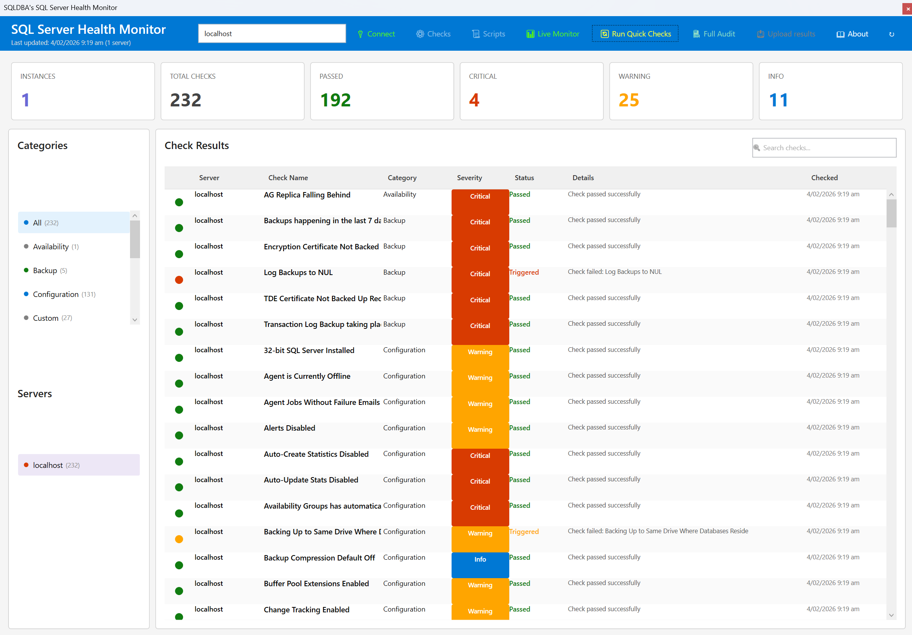
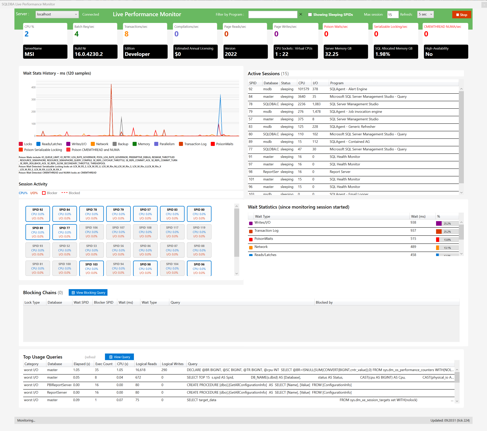

# 🏥 SQL Server Health Monitor

[](https://dotnet.microsoft.com/)
[](https://www.microsoft.com/sql-server)
[](LICENSE)
[](../../releases/latest)

**A professional SQL Server health monitoring application with real-time dashboards, 230+ built-in health checks, and enterprise multi-server support.**


---

## 📥 Download

### Latest Release - v25

| Platform | Framework | Download |
|----------|-----------|----------|
| Windows x64 | .NET 8.0 (Recommended) | [**SqlHealthMonitor-net8-win-x64.zip**](../../releases/latest/download/SqlHealthMonitor-net8-win-x64.zip) |
| Windows x64 | .NET 4.6.2 (Legacy) | [**SqlHealthMonitor-net462-win-x64.zip**](../../releases/latest/download/SqlHealthMonitor-net462-win-x64.zip) |
| Source Code | | [**Source code (zip)**](../../archive/refs/heads/main.zip) |

> **Note:** The .NET 8.0 version is recommended for best performance. Use .NET 4.6.2 for Windows Server 2012 R2 / Windows 7 compatibility.

### System Requirements

- **Operating System:** Windows 10/11, Windows Server 2016+
- **SQL Server:** SQL Server 2016 or newer
- **.NET Runtime:** .NET 8.0 Runtime or .NET Framework 4.6.2+
- **Permissions:** `VIEW SERVER STATE` permission on target SQL Server(s)

---

## ✨ Features

### 🖥️ Live Monitoring Dashboard
Real-time performance monitoring with auto-refresh:
- **CPU & Memory Usage** - Live server resource tracking
- **Wait Statistics** - Visual graph of SQL Server waits over time
- **Active Sessions** - SPID monitoring with blocking detection
- **Top Queries** - Identify expensive queries by I/O and CPU
- **Blocking Chains** - Visual representation of blocking sessions

### 📊 Health Check Dashboard  
Comprehensive SQL Server health assessment:
- **230+ Built-in Checks** - Imported from sp_Blitz and sp_triage
- **Category Filtering** - Backup, Security, Performance, Configuration, etc.
- **Severity Levels** - Critical, Warning, Info classification
- **One-Click Remediation** - View recommended actions for each issue
- **Export to CSV/JSON** - Generate reports for documentation

### 🏢 Enterprise Multi-Server Support
Monitor your entire SQL Server estate:
- **Multiple Servers** - Connect to unlimited SQL instances
- **Parallel Execution** - Run checks across all servers simultaneously
- **Server Health Summary** - At-a-glance status for all instances
- **Consolidated Reporting** - Single view of all server health

### 🔧 Extensible Check System
Customize checks for your environment:
- **JSON Configuration** - Easy-to-edit check definitions
- **Check Manager UI** - Visual editor for creating/modifying checks
- **Import from sp_Blitz** - One-click import of 210+ checks
- **Import from sp_triage** - Import 35+ additional check categories
- **Custom SQL Queries** - Write your own health checks

---

## 🚀 Quick Start

### Option 1: Download Pre-Built Release (Easiest)

1. Download the latest release from the [Releases](../../releases/latest) page
2. Extract the ZIP file
3. Run `SqlMonitorUI.exe`
4. Click **Connect** and enter your SQL Server details
5. Click **Run Checks** to start health assessment

### Option 2: Build from Source

```bash
# Clone the repository
git clone https://github.com/YourUsername/SqlHealthMonitor.git
cd SqlHealthMonitor

# Build the solution
dotnet build

# Run the application
cd SqlMonitorUI
dotnet run
```

---

## 📸 Screenshots

### Main Dashboard
*Health check results with severity indicators and category filtering*

<!-- Add your screenshot here -->


### Live Monitoring
*Real-time performance metrics with wait statistics graph*

<!-- Add your screenshot here -->


### Multi-Server View
*Enterprise view of multiple SQL Server instances*

<!-- Add your screenshot here -->
<!--  -->

---

## 📖 Documentation

| Guide | Description |
|-------|-------------|
| [QUICKSTART.md](QUICKSTART.md) | Get up and running in 5 minutes |
| [USAGE.md](USAGE.md) | Detailed usage instructions |
| [UI-WALKTHROUGH.md](UI-WALKTHROUGH.md) | Complete UI feature guide |
| [CHECK-MANAGER-GUIDE.md](CHECK-MANAGER-GUIDE.md) | Creating and editing health checks |
| [HOW-TO-MODIFY-CHECKS.md](HOW-TO-MODIFY-CHECKS.md) | Customizing check thresholds |
| [IMPORT-SP-BLITZ-GUIDE.md](IMPORT-SP-BLITZ-GUIDE.md) | Importing sp_Blitz checks |
| [DEPLOYMENT-GUIDE.md](DEPLOYMENT-GUIDE.md) | Enterprise deployment options |
| [SECURITY-FEATURES.md](SECURITY-FEATURES.md) | Security configuration |
| [TROUBLESHOOTING.md](TROUBLESHOOTING.md) | Common issues and solutions |

---

## 🏗️ Architecture

```
SqlHealthMonitor/
├── SqlMonitorUI/              # WPF Desktop Application
│   ├── Models/                # Data models (SqlCheck, CheckResult, etc.)
│   ├── Services/              # Business logic
│   │   ├── CheckRunner.cs           # Executes health checks
│   │   ├── CheckRepository.cs       # Manages check configurations
│   │   ├── CompleteHealthCheckRunner.cs  # Full audit runner
│   │   └── SpBlitzParser.cs         # Imports sp_Blitz checks
│   ├── MainWindow.xaml        # Health check dashboard
│   ├── LiveMonitoringWindow.xaml    # Real-time monitoring
│   ├── CheckManagerWindow.xaml      # Check editor
│   └── ConnectionDialog.xaml        # Server connection
├── scripts/                   # Diagnostic SQL scripts folder
├── sql-checks.json           # Health check definitions
└── SqlHealthMonitor.config   # Application settings
```

---

## 🔌 Integration with sp_Blitz

This tool integrates with [Brent Ozar's First Responder Kit](https://github.com/BrentOzarULTD/SQL-Server-First-Responder-Kit):

1. Download `sp_Blitz.sql` from the First Responder Kit
2. In SQL Health Monitor, go to **Check Manager** → **Import Checks**
3. Select the `sp_Blitz.sql` file
4. 210+ checks are automatically imported!

You can also run sp_Blitz directly:
1. Go to **Script Manager**
2. Add the `sp_Blitz.sql` script
3. Click **Run Complete Health Check**
4. Results are exported to CSV automatically

---

## 🛡️ Security

- **Windows Authentication** - Recommended for domain environments
- **SQL Server Authentication** - Supported with secure credential handling
- **Encrypted Connections** - TLS/SSL support for SQL connections
- **No Stored Passwords** - Credentials are not persisted to disk
- **Minimal Permissions** - Only requires `VIEW SERVER STATE`

See [SECURITY-FEATURES.md](SECURITY-FEATURES.md) for detailed security information.

---

## 🤝 Contributing

Contributions are welcome! Here's how you can help:

1. **Report Bugs** - Open an issue with reproduction steps
2. **Suggest Features** - Open an issue with your idea
3. **Submit PRs** - Fork, make changes, submit a pull request
4. **Share Checks** - Contribute new health check definitions
5. **Improve Docs** - Help improve documentation

---

## 📜 License

This project is licensed under the MIT License - see the [LICENSE](LICENSE) file for details.

### Credits & Acknowledgments

- **[Brent Ozar Unlimited](https://www.brentozar.com/)** - sp_Blitz and First Responder Kit (MIT License)
- **[Microsoft SQL Tiger Team](https://github.com/microsoft/tigertoolbox)** - SQL Server best practices
- **[Microsoft.Data.SqlClient](https://github.com/dotnet/SqlClient)** - SQL Server connectivity

---

## 📊 Health Check Categories

| Category | Checks | Description |
|----------|--------|-------------|
| **Backup** | 15+ | Backup recency, log backups, backup compression |
| **Security** | 25+ | SA account, permissions, encryption, auditing |
| **Performance** | 40+ | Index fragmentation, statistics, query plans |
| **Configuration** | 30+ | Server settings, database options, TempDB |
| **Availability** | 20+ | AG health, mirroring, log shipping |
| **Storage** | 15+ | Disk space, file growth, VLF count |
| **Memory** | 10+ | Buffer pool, plan cache, memory grants |
| **CPU** | 10+ | Parallelism, scheduler health, CPU pressure |

---

## 🗺️ Roadmap

- [ ] PowerShell module for automation
- [ ] Web-based dashboard (Blazor)
- [ ] Historical trending and alerts
- [ ] Email/Slack notifications
- [ ] Azure SQL Database support
- [ ] Linux support (.NET 8)

---

## 💬 Support

- **Issues:** [GitHub Issues](../../issues)
- **Discussions:** [GitHub Discussions](../../discussions)

---

<p align="center">
  <b>Made with ❤️ for SQL Server DBAs</b><br>
  <i>Stop firefighting. Start monitoring.</i>
</p>
